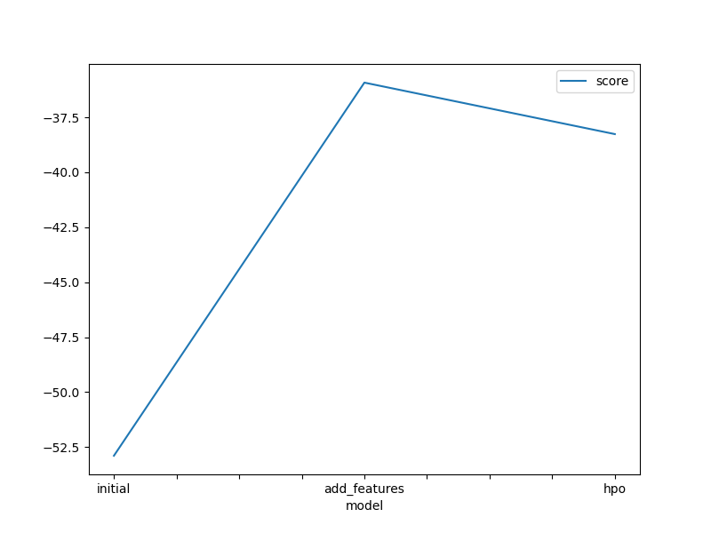
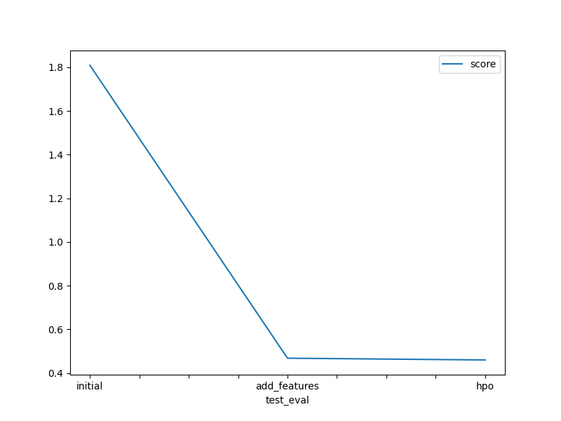

# Report: Predict Bike Sharing Demand with AutoGluon Solution
#### Plabon Dutta

## Initial Training
### What did you realize when you tried to submit your predictions? What changes were needed to the output of the predictor to submit your results?
If there were negative numbers in the series, those were required to be replaced with zeroes.

### What was the top ranked model that performed?
WeightedEnsemble_L3 with hyper parameter tuning.

## Exploratory data analysis and feature creation
### What did the exploratory analysis find and how did you add additional features?
EDA gave insights on central tendency, skewness, outliers and range of the data.
Separated out the datetime into hour, day, month and year parts. Got great insight when observed the historgram of hour feature.

### How much better did your model preform after adding additional features and why do you think that is?
It performed significantly better and score improved from 1.80885 to 0.46811. I think it's because the datetime column was actually separated out in a way that's more meaningful to the model. Besides, season and weather columns were transformed to categorical column. That made the difference as well, because model could now perceive that those weren't just any numbers, but categories.

## Hyper parameter tuning
### How much better did your model preform after trying different hyper parameters?
A slight better. Kaggle score improved from 0.46811 to 0.46007.

### If you were given more time with this dataset, where do you think you would spend more time?
I would probably play with the hyper-parameters a bit more. 
However, feature engineering is another thing that may be worked on if given time.

### Create a table with the models you ran, the hyperparameters modified, and the kaggle score.
|    | model        | hpo1                                                            | hpo2                             | hpo3            | hpo4             |   score |
|---:|:-------------|:----------------------------------------------------------------|:---------------------------------|:----------------|:-----------------|--------:|
|  0 | initial      | default_vals                                                    | default_vals                     | default_vals    | default_vals     | 1.80885 |
|  1 | add_features | default_vals                                                    | default_vals                     | default_vals    | default_vals     | 0.46811 |
|  2 | hpo          | NN: num_epochs, learning_rate, activation, layers, dropout_prob | GBM: num_boost_round, num_leaves | CAT: iterations | XT: n_estimators | 0.46007 |

### Create a line plot showing the top model score for the three (or more) training runs during the project.

### Create a line plot showing the top kaggle score for the three (or more) prediction submissions during the project.

## Summary
I think this was a great project to work on. 
It sheds light on the importance of both feature engineering and hyper parameter optimization in machine learning workflow.
 
AutoGluon can work great for these types of problems with labeled data as it operates 
in the supervised machine learning domain. It relies on strategies like multi-layer stack ensembles.
AutoGluon is both memory aware and state aware.
 
Just some basic EDA improved the score significantly. After that, I tuned some of the hyper-parameters and 
that yielded a slightly better score.